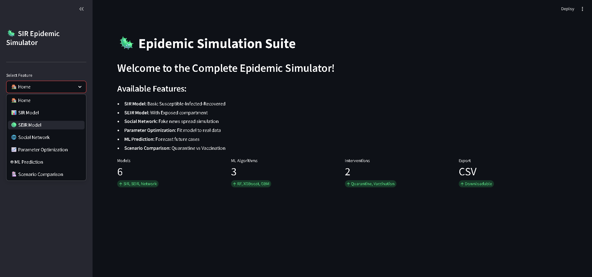

# 🦠 SIR Epidemic Simulator

<div align="center">


**A Complete Epidemic Modeling Suite with 5 Integrated Features**

</div>

---

## 📋 Table of Contents

- [Overview](#-overview)
- [Features](#-features)
- [Installation](#-installation)
- [Quick Start](#-quick-start)
- [Project Structure](#-project-structure)
- [Usage Guide](#-usage-guide)
- [Testing](#-testing)
- [API Reference](#-api-reference)
- [License](#-license)

---

## 🔭 Overview

The **SIR Epidemic Simulator** is a comprehensive epidemic modeling toolkit combining classical compartmental models with modern machine learning.

---

## 📸 Screenshots

| SIR Model | SEIR Model |
|:---:|:---:|
|  |  |

| Network Simulation | Parameter Optimization |
|:---:|:---:|
|  |  |

| ML Prediction | Scenario Comparison |
|:---:|:---:|
|  |  |

### 📊 Streamlit Dashboard

---

### Key Capabilities

| Feature | Description |
|---------|-------------|
| **SIR Model** | Basic Susceptible-Infected-Recovered dynamics |
| **SEIR Model** | Adds Exposed/incubation compartment |
| **Network Simulation** | Fake news spread on social graphs |
| **Parameter Optimization** | Fit models to real-world data |
| **ML Prediction** | Forecast future cases with XGBoost/Random Forest |
| **Scenario Comparison** | Evaluate quarantine vs vaccination |

---

## 🚀 Installation

### Prerequisites
- Python 3.8+

### Steps

```bash
# Clone repository
git clone https://github.com/miladrezanezhad/sir_simulator.git
cd sir_simulator

# Install dependencies
pip install -r config/requirements.txt

# Verify installation
python -c "import streamlit, numpy, pandas; print('✅ Success!')"
```

---


## 🎮 Quick Start

### Launch Web Dashboard

```bash
python -m streamlit run user_interface/app.py
```

### Run CLI

```bash
python user_interface/cli.py --beta 0.5 --gamma 0.2 --tmax 100
```

### Run All Tests

```bash
python run_all_tests.py
```

### Interactive Menu

```bash
python main.py
```

---

## 📁 Project Structure

```
sir_simulator/
│
├── core_models/              # Core mathematical models
│   ├── sir_model.py          # Basic SIR implementation
│   ├── seir_model.py         # SEIR with exposed compartment
│   └── network_model.py      # Social network spread simulation
│
├── advanced_features/        # Advanced capabilities
│   ├── parameter_optimization.py  # Curve fitting
│   ├── ml_prediction.py           # ML forecasting
│   └── scenario_comparison.py     # Intervention analysis
│
├── user_interface/           # UI applications
│   ├── app.py                # Streamlit dashboard
│   └── cli.py                # Command-line interface
│
├── tests/                    # Test suite (25+ tests)
│   ├── test_seir.py
│   ├── test_network.py
│   ├── test_optimization.py
│   ├── test_ml.py
│   └── test_scenarios.py
│
├── docs/                     # Documentation
│   └── notebook.ipynb        # Educational Jupyter notebook
│
├── config/                   # Configuration
│   └── requirements.txt      # Python dependencies
│
├── outputs/                  # CSV export folder
│
├── README.md                 # This file
├── run_all_tests.py          # Test runner
├── main.py                   # Main entry point
└── .gitignore
```

---

## 📊 Usage Guide

### 1. SIR Model

```python
from core_models.sir_model import run_sir_simulation

df = run_sir_simulation(
    beta=0.5, gamma=0.2,
    S0=990, I0=10, R0=0,
    t_max=100, steps=500
)
```

### 2. SEIR Model

```python
from core_models.seir_model import run_seir_simulation

df = run_seir_simulation(
    beta=0.5, sigma=0.2, gamma=0.1,
    S0=990, E0=0, I0=10, R0=0,
    t_max=100, steps=500
)
```

### 3. Network Simulation

```python
from core_models.network_model import SocialNetworkSimulator

sim = SocialNetworkSimulator(num_nodes=200, network_type='scale_free')
df = sim.simulate_spread(transmission_prob=0.4, recovery_prob=0.1)
```

### 4. Parameter Optimization

```python
from advanced_features.parameter_optimization import ParameterOptimizer

optimizer = ParameterOptimizer(model_type='sir')
results = optimizer.fit(observed_data, t, [990, 10, 0])
print(f"β={results['beta']:.3f}, γ={results['gamma']:.3f}")
```

### 5. ML Prediction

```python
from advanced_features.ml_prediction import EpidemicPredictor

predictor = EpidemicPredictor(model_type='random_forest')
metrics, predictions, _ = predictor.train(historical_data)
future = predictor.predict_future(historical_data, days=30)
```

### 6. Scenario Comparison

```python
from advanced_features.scenario_comparison import ScenarioComparator

comp = ScenarioComparator()
scenarios, metrics = comp.compare_all_scenarios(days=120)
```

---

## 🧪 Testing

### Run All Tests

```bash
python run_all_tests.py
```

### Test Coverage

| Module | Tests | Status |
|--------|-------|--------|
| SEIR Model | 4 | ✅ |
| Network Simulation | 5 | ✅ |
| Parameter Optimization | 6 | ✅ |
| ML Prediction | 7 | ✅ |
| Scenario Comparison | 3 | ✅ |
| **Total** | **25** | ✅ |

### Individual Tests

```bash
python tests/test_seir.py
python tests/test_network.py
python tests/test_optimization.py
python tests/test_ml.py
python tests/test_scenarios.py
```

---

## 📈 Sample Output

### SIR Simulation (CSV)

```csv
time,Susceptible,Infected,Recovered
0.0,990.0,10.0,0.0
0.5,985.2,14.5,0.3
1.0,979.8,19.6,0.6
```

### Network Simulation

```
Network Stats: {'nodes': 200, 'edges': 597, 'avg_degree': 5.97}
Peak spreaders: 67 at step 12
Final reach: 84.5% of network
```

### ML Prediction

```
Training R²: 0.967
Testing R²: 0.901
30-day forecast peak: 127 cases
```

---

## 🔧 Requirements

```txt
numpy>=1.21.0
scipy>=1.7.0
pandas>=1.3.0
matplotlib>=3.4.0
streamlit>=1.20.0
networkx>=2.8
scikit-learn>=1.0.0
xgboost>=1.6.0
```

---

## 📄 License

MIT License - See LICENSE file for details.

---

<div align="center">

**Built with ❤️ for epidemic modeling and public health research**

[⬆ Back to Top](#-sir-epidemic-simulator)

</div>
```

---

